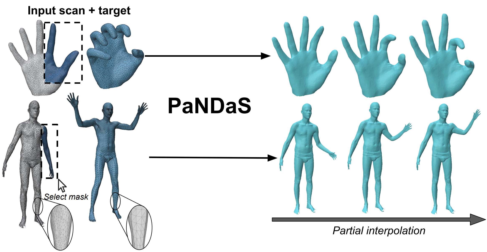

# PaNDaS: Learnable Shape Interpolation Modeling with Localized Control

### [Paper](https://arxiv.org/abs/XXXX.XXXXX) | [Project Page](https://example.com/pandas) | [Video](https://example.com/pandas/video)

> **PaNDaS: Learnable Shape Interpolation Modeling with Localized Control**  
> Thomas Besnier, Emery Pierson, Sylvain Arguillère, Maks Ovsjanikov, Mohamed Daoudi  
> *CVPR 2026*



PaNDaS is a deep learning framework for **Partial Non-Rigid Deformations and interpolations of Surfaces**. It learns per-face features on a source mesh and fuses them with a global target encoding to enable localized, vertex-level deformation control — without requiring texture maps, skeleton rigs, or correspondence maps.

---

## Features

- **Localized deformations** via user-defined binary masks on mesh faces
- **Partial pose interpolation** on both registered meshes and raw scans
- **Pose mixing**: combine deformations from multiple source poses
- **Motion transfer**: apply partial poses from one identity to another
- **Shape statistics**: compute partial means and principal components in the latent space

---

## Installation

```bash
git clone https://github.com/tbesnier/PaNDaS.git
cd PaNDaS
conda create -n PaNDaS python=3.10
conda activate PaNDaS
pip install -r requirements.txt
```

**Requirements**: PyTorch >= 2.0, [DiffusionNet](https://github.com/nmwsharp/diffusion-net), PyTorch3D (for Poisson solve). See `requirements.txt` for the full list.

---

## Datasets

The paper uses three datasets. Download and place them under `data/`:

| Dataset | Type |
|---------|------|
| [MANO](https://mano.is.tue.mpg.de/) | Hands |
| [DFAUST](https://dfaust.is.tue.mpg.de/) | Bodies |
| [COMA](https://coma.is.tue.mpg.de/) | Faces |

---

## Training

```bash
python train.py --dataset mano --data_dir data/mano/ --output_dir checkpoints/
```

Key arguments:
- `--dataset`: one of `mano`, `dfaust`, `coma`
- `--epochs`: number of training epochs (default: 1000)
- `--lr`: learning rate (default: 1e-4)
- `--lambda_n`: weight of the normal regularization loss (default: 1e-5)
- `--latent_dim`: size of the global latent vector (default: 64)
- `--num_eigvecs`: number of eigenvectors for global aggregation (default: 4)

---

## Inference

### Full interpolation
```python
python interpolate.py \
  --checkpoint checkpoints/mano.pth \
  --source data/source.obj \
  --target data/target.obj \
  --steps 10
```

### Partial interpolation (with mask)
```python
python interpolate.py \
  --checkpoint checkpoints/mano.pth \
  --source data/source.obj \
  --target data/target.obj \
  --mask data/mask.npy \   # binary face mask, shape (num_faces,)
  --steps 10
```

### Pose mixing
```python
python mix_poses.py \
  --checkpoint checkpoints/dfaust.pth \
  --source data/neutral.obj \
  --poses data/pose1.obj data/pose2.obj \
  --masks data/mask1.npy data/mask2.npy
```
---

## Pretrained Checkpoints

| Dataset | Download |
|---------|----------|
| MANO | [download](https://example.com/checkpoints/mano.pth) |
| DFAUST | [download](https://example.com/checkpoints/dfaust.pth) |
| COMA | [download](https://example.com/checkpoints/coma.pth) |

---

## Citation

If you find this work useful, please cite:

```bibtex
@inproceedings{besnier2026pandas,
  title     = {PaNDaS: Learnable Shape Interpolation Modeling with Localized Control},
  author    = {Besnier, Thomas and Pierson, Emery and Arguill{\`e}re, Sylvain and Ovsjanikov, Maks and Daoudi, Mohamed},
  booktitle = {Proceedings of the IEEE/CVF Conference on Computer Vision and Pattern Recognition (CVPR)},
  year      = {2026}
}
```

---

## Acknowledgements

This work was partially supported by the project **4DSHAPE ANR-24-CE23-5907** of the French National Research Agency (ANR). We build on [DiffusionNet](https://github.com/nmwsharp/diffusion-net) and [Neural Jacobian Fields](https://github.com/ThibaultGROUEIX/NeuralJacobianFields).

---

## License

This project is released under the [MIT License](LICENSE).